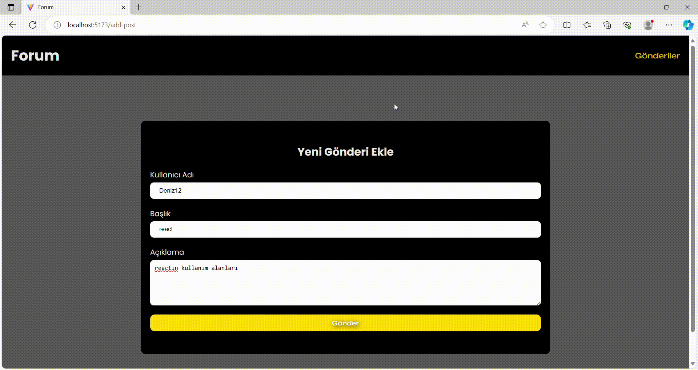

# MVC ( Model View Controller)

- Model : Uygulamanın veri mantığını | veri yapısı temsil eder.
- - Örn: Projede state'inin tutucağımız bir formun obje şekilinde değerleri

- View : Kullanıcı Arayüznü temsil eder.
- - JSX Kodları burada yazılır (div,form,header)

- Controller: Model ve View Arasında iletişim kurar.
- - KULLANICI ETKİLEŞİMİNDE ÇALIŞICAK FONKSİYONLAR APİ İstekleri burada tutulur

# Kütüphaneler

- axios
- react-router-dom
- json-server (sahte veri tabanı)
- sass

# Yapılacaklar

- Api blog verilerini al `Controller`
- - Her blog verisi için ekrana kart bas `View`

- Bir form arayüzü oluştur `View`
- - Formdaki inputlar değitişğinde state'lerini tut `Controller`
- - State tutulucak değerleri belirle `Model`
- - Gönderlidğinde post'u api'ye gönder ve kullanıcyı yönlendir `Controller`

### 'Screen'

# forum-MVC
